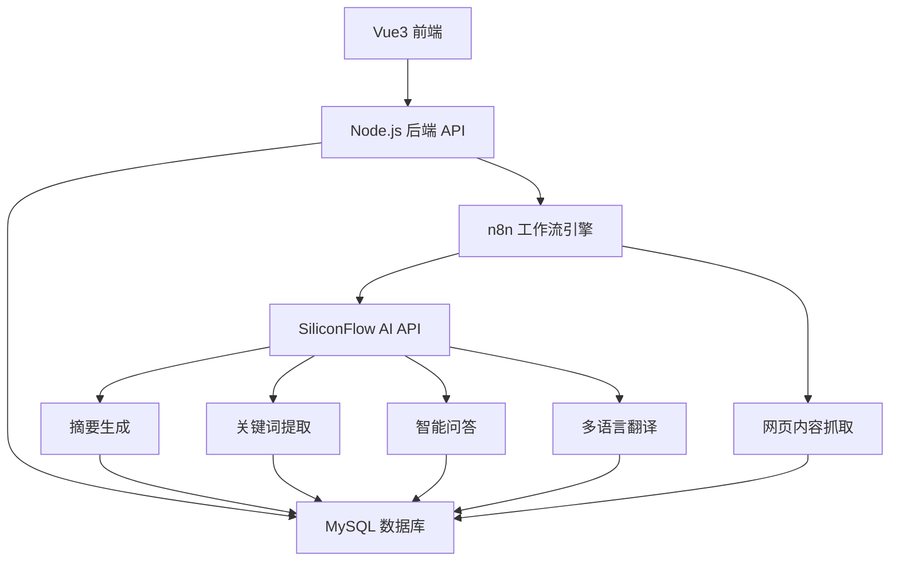

# SmartDigest - 智能内容摘要与洞察助手

<div align="center">


一个基于AI的智能内容处理平台，能够自动抓取网页内容、生成摘要、提取关键词、提供智能问答等功能。

[功能特性](#-功能特性) • [快速开始](#-快速开始) • [技术架构](#️-技术架构) • [API文档](#-api文档) • [部署指南](#-部署指南)

</div>

---

## 🌟 功能特性

### 🔄 自动化工作流
- **智能内容抓取**: 使用n8n实现全自动的网页内容抓取和AI处理流程
- **批量处理**: 支持同时处理多个网页URL
- **状态跟踪**: 实时监控处理进度和状态

### 🤖 AI智能分析
- **智能摘要生成**: 基于SiliconFlow API生成高质量文章摘要
- **关键词提取**: 自动识别文章核心关键词和标签
- **多语言翻译**: 支持文章内容翻译到多种语言
- **智能问答**: 基于文章内容的AI问答交互系统

### 🌐 网页内容处理
- **通用网页支持**: 支持大部分主流网站的内容提取
- **内容清洗**: 自动过滤广告、导航等无关内容
- **格式优化**: 智能识别和保留文章结构

### 📱 现代化界面
- **响应式设计**: 基于Vue3 + Element Plus的现代化界面
- **移动端适配**: 完美支持手机、平板等移动设备
- **流畅动画**: 丰富的页面切换和交互动画效果
- **主题定制**: 支持深色/浅色主题切换

### 🔒 用户系统
- **安全认证**: 基于JWT的用户认证系统
- **权限管理**: 完整的用户权限和访问控制
- **数据隔离**: 用户数据完全隔离，保护隐私

---

## 🏗️ 技术架构



### 技术栈详情

| 层级 | 技术 | 版本 | 说明 |
|------|------|------|------|
| **前端** | Vue.js | 3.5+ | 渐进式JavaScript框架 |
| | Element Plus | 2.4+ | Vue3组件库 |
| | Pinia | 3.0+ | 状态管理 |
| | Vue Router | 4.5+ | 路由管理 |
| | Axios | 1.6+ | HTTP客户端 |
| **后端** | Node.js | 20+ | JavaScript运行时 |
| | Express | 4.18+ | Web应用框架 |
| | MySQL2 | 3.6+ | 数据库驱动 |
| | JWT | 9.0+ | 身份认证 |
| | bcryptjs | 2.4+ | 密码加密 |
| **自动化** | n8n | Latest | 工作流自动化平台 |
| **AI服务** | SiliconFlow | Latest | 大语言模型API |
| **数据库** | MySQL | 8.0+ | 关系型数据库 |

---

## 📋 功能模块

### 🔐 用户管理模块
- **用户注册**: 支持用户名/邮箱注册
- **用户登录**: JWT令牌认证
- **个人信息**: 用户资料管理
- **密码安全**: bcrypt加密存储

### 📝 文章管理模块
- **URL添加**: 智能URL验证和添加
- **自动抓取**: n8n工作流自动处理
- **状态跟踪**: 处理进度实时更新
- **批量操作**: 支持批量删除、导出等

### 🧠 AI处理模块
- **摘要生成**: 智能文章摘要提取
- **关键词提取**: 自动识别核心关键词
- **智能翻译**: 多语言内容翻译
- **问答系统**: 基于文章内容的AI对话

### 📊 数据展示模块
- **仪表板**: 数据统计和概览
- **文章列表**: 分页展示和筛选
- **详情页面**: 完整内容展示
- **实时更新**: WebSocket实时状态同步

---

## 🚀 快速开始

### 环境要求

- **Node.js**: 20.19.0 或更高版本
- **MySQL**: 8.0 或更高版本
- **n8n**: 最新版本（可选，用于自动化工作流）
- **操作系统**: Windows 10+, macOS 10.15+, Ubuntu 18.04+

### 1. 克隆项目

```bash
git clone <repository-url>
cd final-project
```

### 2. 一键启动（推荐）

**Windows用户:**
```bash
# 双击运行启动脚本
start-dev.bat
```

**Linux/macOS用户:**
```bash
# 运行启动脚本
chmod +x start-dev.sh
./start-dev.sh
```

### 3. 手动启动

#### 后端设置

```bash
cd backend
npm install

# 配置环境变量
cp .env.example .env
# 编辑 .env 文件，填入数据库配置和API密钥

# 启动后端服务
npm run dev
```

#### 前端设置

```bash
cd frontend/final-project
npm install

# 启动前端开发服务器
npm run dev
```

### 4. 数据库配置

确保MySQL服务运行，创建数据库：

```sql
CREATE DATABASE smartdigest CHARACTER SET utf8mb4 COLLATE utf8mb4_unicode_ci;
```

数据库表将在首次启动后端时自动创建。

### 5. n8n配置（可选但推荐）

```bash
# 全局安装n8n
npm install -g n8n

# 启动n8n
n8n
```

访问 http://localhost:5678 配置工作流，详见 [N8N_SETUP.md](N8N_SETUP.md)

---

## 📁 项目结构

```
final-project/
├── 📁 backend/                    # 后端API服务
│   ├── 📁 config/                 # 数据库配置
│   │   └── database.js           # 数据库连接配置
│   ├── 📁 middleware/             # 中间件
│   │   └── auth.js               # JWT认证中间件
│   ├── 📁 routes/                 # API路由
│   │   ├── auth.js               # 用户认证路由
│   │   ├── articles.js           # 文章管理路由
│   │   └── ai.js                 # AI处理路由
│   ├── 📄 server.js              # 服务器入口文件
│   ├── 📄 package.json           # 后端依赖配置
│   └── 📄 .env.example           # 环境变量模板
├── 📁 frontend/final-project/     # Vue3前端项目
│   ├── 📁 src/
│   │   ├── 📁 components/         # 可复用组件
│   │   │   └── ArticleCard.vue   # 文章卡片组件
│   │   ├── 📁 views/              # 页面视图
│   │   │   ├── DashboardView.vue # 仪表板页面
│   │   │   ├── ArticlesView.vue  # 文章列表页面
│   │   │   ├── AddArticleView.vue# 添加文章页面
│   │   │   ├── ArticleDetailView.vue# 文章详情页面
│   │   │   ├── LoginView.vue     # 登录页面
│   │   │   ├── RegisterView.vue  # 注册页面
│   │   │   └── NotFoundView.vue  # 404页面
│   │   ├── 📁 stores/             # Pinia状态管理
│   │   │   ├── auth.js           # 用户认证状态
│   │   │   ├── article.js        # 文章数据状态
│   │   │   └── ui.js             # UI状态管理
│   │   ├── 📁 router/             # 路由配置
│   │   │   └── index.js          # 路由定义
│   │   ├── 📄 App.vue             # 根组件
│   │   └── 📄 main.js             # 前端入口文件
│   ├── 📄 package.json            # 前端依赖配置
│   └── 📄 vite.config.js          # Vite构建配置
├── 📄 n8n-workflow.json          # n8n工作流配置
├── 📄 N8N_SETUP.md              # n8n配置指南
├── 📄 start-dev.bat             # Windows启动脚本
├── 📄 start-dev.sh              # Linux/macOS启动脚本
├── 📄 需求文档.md                # 项目需求文档
└── 📄 README.md                 # 项目说明文档
```

---

## 🔧 环境变量配置

### 后端环境变量 (.env)

```env
# 服务器配置
PORT=3000
NODE_ENV=development
FRONTEND_URL=http://localhost:5173

# 数据库配置
DB_HOST=localhost
DB_PORT=3306
DB_NAME=smartdigest
DB_USER=root
DB_PASSWORD=your_password

# JWT配置
JWT_SECRET=your_jwt_secret_key_here
JWT_EXPIRES_IN=7d

# AI API配置
SILICONFLOW_API_KEY=your_siliconflow_api_key
SILICONFLOW_BASE_URL=https://api.siliconflow.cn

# n8n配置
N8N_WEBHOOK_URL=http://localhost:5678/webhook/process-article
N8N_API_KEY=your_n8n_api_key
```

### 前端环境变量 (.env)

```env
# API配置
VITE_API_BASE_URL=http://localhost:3000/api
VITE_APP_TITLE=SmartDigest
VITE_APP_VERSION=1.0.0
```

---

## 🔑 API密钥获取

### SiliconFlow API

1. 访问 [SiliconFlow官网](https://cloud.siliconflow.cn/)
2. 注册并登录账号
3. 在控制台创建API密钥
4. 将密钥填入 `SILICONFLOW_API_KEY` 环境变量

### n8n配置

1. 安装n8n: `npm install -g n8n`
2. 启动n8n: `n8n`
3. 访问 http://localhost:5678
4. 导入 `n8n-workflow.json` 工作流配置

---

## 🎯 使用流程

### 1. 用户注册/登录
- 访问前端应用
- 注册新账号或使用现有账号登录
- 系统自动生成JWT令牌

### 2. 添加文章URL
- 在仪表板点击"添加文章"
- 输入要分析的网页URL
- 系统自动验证URL格式

### 3. 自动处理
- n8n工作流自动抓取网页内容
- 调用AI API进行内容分析
- 生成摘要、关键词、翻译等结果

### 4. 查看结果
- 在文章详情页查看完整分析结果
- 支持摘要、关键词、翻译等展示
- 实时状态更新

### 5. 智能问答
- 基于文章内容进行AI对话
- 支持上下文相关的问答
- 历史对话记录保存

### 6. 内容管理
- 批量操作文章
- 导出分析结果
- 删除不需要的文章

---

## 🛠️ 开发指南

### 数据库模型

```sql
-- 用户表
CREATE TABLE users (
    id INT PRIMARY KEY AUTO_INCREMENT,
    username VARCHAR(50) UNIQUE NOT NULL,
    email VARCHAR(100) UNIQUE NOT NULL,
    password VARCHAR(255) NOT NULL,
    created_at TIMESTAMP DEFAULT CURRENT_TIMESTAMP,
    updated_at TIMESTAMP DEFAULT CURRENT_TIMESTAMP ON UPDATE CURRENT_TIMESTAMP
);

-- 文章表
CREATE TABLE articles (
    id INT PRIMARY KEY AUTO_INCREMENT,
    user_id INT NOT NULL,
    url VARCHAR(500) NOT NULL,
    title VARCHAR(500),
    content LONGTEXT,
    status ENUM('pending', 'processing', 'completed', 'failed') DEFAULT 'pending',
    created_at TIMESTAMP DEFAULT CURRENT_TIMESTAMP,
    updated_at TIMESTAMP DEFAULT CURRENT_TIMESTAMP ON UPDATE CURRENT_TIMESTAMP,
    FOREIGN KEY (user_id) REFERENCES users(id) ON DELETE CASCADE
);

-- AI结果表
CREATE TABLE ai_results (
    id INT PRIMARY KEY AUTO_INCREMENT,
    article_id INT NOT NULL,
    summary TEXT,
    keywords JSON,
    translation TEXT,
    language VARCHAR(10),
    created_at TIMESTAMP DEFAULT CURRENT_TIMESTAMP,
    FOREIGN KEY (article_id) REFERENCES articles(id) ON DELETE CASCADE
);

-- 对话表
CREATE TABLE conversations (
    id INT PRIMARY KEY AUTO_INCREMENT,
    article_id INT NOT NULL,
    user_id INT NOT NULL,
    question TEXT NOT NULL,
    answer TEXT NOT NULL,
    created_at TIMESTAMP DEFAULT CURRENT_TIMESTAMP,
    FOREIGN KEY (article_id) REFERENCES articles(id) ON DELETE CASCADE,
    FOREIGN KEY (user_id) REFERENCES users(id) ON DELETE CASCADE
);
```

### API接口文档

#### 认证接口

| 方法 | 路径 | 描述 | 请求体 | 响应 |
|------|------|------|--------|------|
| POST | `/api/auth/register` | 用户注册 | `{username, email, password}` | `{token, user}` |
| POST | `/api/auth/login` | 用户登录 | `{username/email, password}` | `{token, user}` |
| GET | `/api/auth/me` | 获取用户信息 | - | `{user}` |

#### 文章接口

| 方法 | 路径 | 描述 | 请求体 | 响应 |
|------|------|------|--------|------|
| GET | `/api/articles` | 获取文章列表 | `?page=1&limit=10` | `{articles, total, page}` |
| POST | `/api/articles` | 添加文章 | `{url}` | `{article}` |
| GET | `/api/articles/:id` | 获取文章详情 | - | `{article, aiResults}` |
| DELETE | `/api/articles/:id` | 删除文章 | - | `{message}` |

#### AI接口

| 方法 | 路径 | 描述 | 请求体 | 响应 |
|------|------|------|--------|------|
| POST | `/api/ai/ask` | 智能问答 | `{articleId, question}` | `{answer}` |
| POST | `/api/ai/regenerate-summary/:id` | 重新生成摘要 | - | `{summary}` |
| POST | `/api/ai/translate/:id` | 翻译文章 | `{language}` | `{translation}` |

---

## 📱 界面展示

### 登录页面
- 简洁现代的用户登录界面
- 支持用户名/邮箱登录
- 响应式设计，适配移动端

### 仪表板
- 数据统计卡片展示
- 最近文章快速预览
- 快速操作入口

### 文章列表
- 分页展示文章列表
- 状态筛选和搜索功能
- 批量操作支持

### 文章详情
- 完整的文章信息展示
- 实时智能问答交互
- 多种内容操作选项

---

## 🚀 部署指南

### Docker部署（推荐）

```yaml
# docker-compose.yml
version: '3.8'
services:
  mysql:
    image: mysql:8.0
    environment:
      MYSQL_ROOT_PASSWORD: your_password
      MYSQL_DATABASE: smartdigest
    ports:
      - "3306:3306"
    volumes:
      - mysql_data:/var/lib/mysql

  backend:
    build: ./backend
    ports:
      - "3000:3000"
    environment:
      - DB_HOST=mysql
      - DB_PASSWORD=your_password
    depends_on:
      - mysql

  frontend:
    build: ./frontend/final-project
    ports:
      - "5173:5173"
    depends_on:
      - backend

  n8n:
    image: n8nio/n8n
    ports:
      - "5678:5678"
    environment:
      - N8N_HOST=0.0.0.0
    volumes:
      - n8n_data:/home/node/.n8n

volumes:
  mysql_data:
  n8n_data:
```

### 生产环境配置

1. **环境变量**: 确保所有敏感信息通过环境变量配置
2. **HTTPS**: 配置SSL证书
3. **数据库**: 使用生产级MySQL配置
4. **监控**: 添加日志监控和错误追踪
5. **备份**: 定期备份数据库

---

## 🤝 贡献指南

我们欢迎所有形式的贡献！

### 如何贡献

1. **Fork** 项目到你的GitHub账号
2. **创建** 功能分支 (`git checkout -b feature/AmazingFeature`)
3. **提交** 更改 (`git commit -m 'Add some AmazingFeature'`)
4. **推送** 到分支 (`git push origin feature/AmazingFeature`)
5. **开启** Pull Request

### 开发规范

- 遵循ESLint代码规范
- 编写清晰的提交信息
- 添加必要的测试用例
- 更新相关文档

---

## 📄 开源协议

本项目基于 MIT 协议开源 - 查看 [LICENSE](LICENSE) 文件了解详情

---

## 🔗 相关链接

- [Vue.js 官方文档](https://vuejs.org/)
- [Element Plus 组件库](https://element-plus.org/)
- [n8n 自动化平台](https://n8n.io/)
- [SiliconFlow AI平台](https://cloud.siliconflow.cn/)
- [MySQL 官方文档](https://dev.mysql.com/doc/)

---

## 📧 联系方式

如有问题或建议，请通过以下方式联系：

- **项目Issues**: [GitHub Issues](https://github.com/your-repo/issues)
- **邮箱**: your-email@example.com
- **QQ群**: 123456789

---

## 🙏 致谢

感谢以下开源项目和服务：

- [Vue.js](https://vuejs.org/) - 渐进式JavaScript框架
- [Element Plus](https://element-plus.org/) - Vue3组件库
- [n8n](https://n8n.io/) - 工作流自动化平台
- [SiliconFlow](https://cloud.siliconflow.cn/) - AI大模型服务
- [MySQL](https://www.mysql.com/) - 关系型数据库

---

<div align="center">

**⭐ 如果这个项目对你有帮助，请给它一个星标！**

Made with ❤️ by SmartDigest Team

</div>
